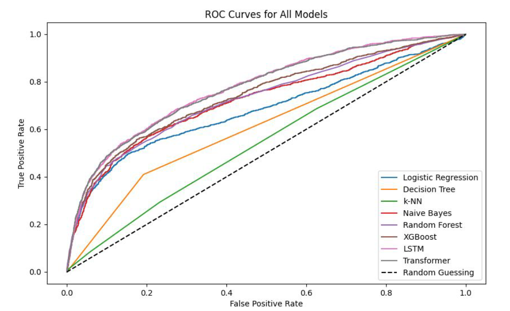
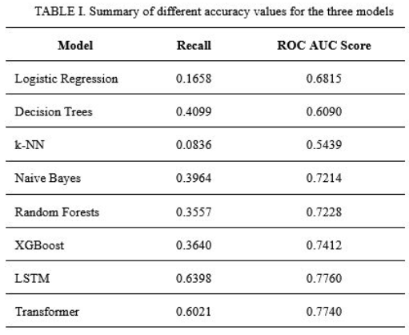

# Credit Card Default Predictor
This project implements a predictive pipeline to identify credit card defaults using the CC Default dataset. It benchmarks classical ML (XGBoost, Random Forest) against deep learning architectures (LSTM, Transformer) built in PyTorch. The repository features robust EDA, automated sequence preprocessing, and stratified K-fold cross-validation.

## 📊 Evaluation Results

The models were evaluated based on their ability to predict defaults accurately while minimizing false negatives.

### ROC Curve Comparison
This plot visualizes the trade-off between the True Positive Rate and False Positive Rate across all tested architectures.



### Model Performance Summary
The following table provides a side-by-side comparison of AUC, Recall, and Precision for classical and deep learning models.



## Project Structure

This repository uses a flat structure for transparency and ease of execution. All core logic and execution scripts are located in the root directory:
```text
.
├── .gitignore            # Data and environment exclusions
├── LICENSE               # MIT License
├── README.md             # Project documentation
├── cc_eda_00.py          # Exploratory Data Analysis & Visualizations
├── cc_pipeline_01.py     # Main pipeline: benchmarks models
├── cc_timeseries_02.py   # Model architectures & K-Fold logic
├── comparison_curve.png  # Visual: ROC Curve comparison
├── comparison_table.png  # Visual: Performance metrics table
└── requirements.txt      # Project dependencies
```

## Data Acquisition

The dataset used in this project is the **Default of Credit Card Clients** dataset, hosted by the UCI Machine Learning Repository. 

To run the scripts in this repository, follow these steps:
1. Download the dataset from [UCI Machine Learning Repository](https://archive.ics.uci.edu/dataset/350/default+of+credit+card+clients).
2. Extract the file and ensure it is named `cc_default.xls`.
3. Place the file in the root directory of this project.

*Note: This file is excluded from the repository via `.gitignore` to maintain a lightweight footprint.*

## Key Features
Deep Learning Architectures: Custom-built LSTM and Transformer models designed to handle temporal billing and payment sequences.
Hybrid Data Processing: Dual-stream preprocessing that handles static demographic data and sequential financial data simultaneously.
Robust Validation: Utilizes Stratified K-Fold Cross-Validation and Random Oversampling to address class imbalance and ensure model stability.
Benchmarking: Comparative analysis against classical classifiers including XGBoost, Random Forest, and Naive Bayes.

